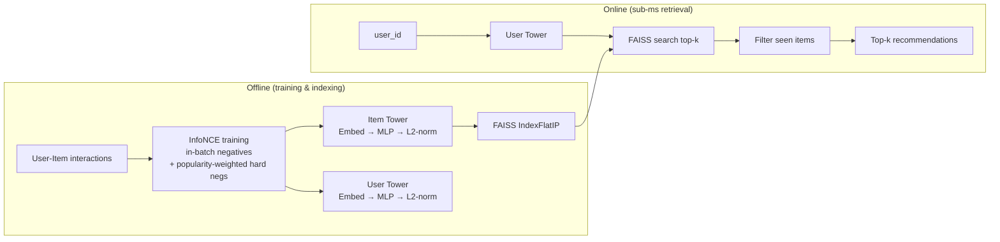

# Two-Tower Retrieval System

A production-style neural retrieval system for recommendation, trained on **MovieLens-1M** (1M interactions). Implements the same architecture used by Google's YouTube recommender (Yi et al., 2019): two independent neural towers learn user and item representations via contrastive learning, and serving uses a FAISS index for sub-millisecond retrieval.

[](https://github.com/USERNAME/two-tower-retrieval-system/actions/workflows/ci.yml)

---

## Architecture



**Key insight:** because the towers are independent at inference, item embeddings are pre-computed once. Only the user tower runs at query time → O(1) work + O(log N) FAISS search regardless of catalogue size.

---

## Results (MovieLens-1M, time-based split)

| Model | Recall@10 | MRR@10 | NDCG@10 | Notes |
|---|---|---|---|---|
| **Two-Tower (BPR)** | **0.5667** | **0.3028** | **0.7988** | BPR + popularity-weighted negatives, D=128 |
| Two-Tower (InfoNCE) | 0.3363 | 0.1265 | 0.2708 | YouTube-paper loss, same config |
| MF Baseline | 0.1317 | 0.0432 | 0.0734 | Plain matrix factorization |

**~4.3x lift over MF baseline** and **+68.5% over InfoNCE** on Recall@10. See [`comparison_results.md`](comparison_results.md) and [`ablation_results.md`](ablation_results.md) for the full controlled comparison.

### Key finding from ablation
BPR with random negatives **beat** InfoNCE with in-batch negatives by 2x on this dataset — opposite of what the YouTube paper suggests. Hypothesis: ML-1M's popularity skew causes InfoNCE to wrongly demote blockbusters. Discussion in [`DECISIONS.md`](DECISIONS.md).

### Latency (single query, MacBook Pro M-series, MPS)

| Stage | Time |
|---|---|
| User tower forward pass | ~0.17 ms |
| FAISS search (top-10) | ~0.25 ms |
| **Total end-to-end** | **~0.42 ms** |

---

## Key Engineering Decisions

| Decision | Choice | Why |
|---|---|---|
| Architecture | Two-tower (separable) | Item embeddings precomputed → O(1) at query time |
| Loss | InfoNCE with in-batch negatives | Same as YouTube paper; provides B-1 hard negatives for free |
| Negative sampling | Popularity-weighted (`count^0.75`) | Long-tail uniform negatives are uninformative |
| Index | FAISS `IndexFlatIP` (exact) | <0.5ms at this scale; swap to IVF/HNSW for prod |
| Train/test split | Chronological 80/20 | Random split leaks future → inflated metrics |
| Embedding dim | 128 | Sweet-spot from ablation study |

See [`DECISIONS.md`](DECISIONS.md) for the full design log including bugs hit and how I caught them.

---

## Project Structure

```
two-tower-retrieval-system/
├── configs/config.yaml          # Hyperparameters & dataset path
├── data/raw/ml-1m/              # MovieLens-1M (1M ratings)
├── src/
│   ├── data/                    # Encoder, dataset, time-based split
│   ├── models/                  # TwoTowerModel + MFBaseline
│   ├── training/trainer.py      # InfoNCE & BPR training loops
│   ├── evaluation/              # Recall@k, MRR@k, NDCG@k
│   └── indexing/build_index.py  # FAISS index construction
├── api/app.py                   # FastAPI serving endpoint
├── tests/                       # 14 pytest unit tests
├── .github/workflows/ci.yml     # CI runs tests on every push
├── train.py                     # Training entry point
├── build_index.py               # Build FAISS index after training
├── ablation.py                  # Ablation study runner
├── benchmark.py                 # Latency benchmarking
├── serve.py                     # Single-query latency check
├── Dockerfile                   # Production container
├── Makefile                     # One-command workflows
├── requirements.txt
├── README.md
└── DECISIONS.md                 # Design log & lessons learned
```

---

## Quickstart

```bash
# 1. Install dependencies + download data
make install
make data

# 2. Train (≈ 5 min on Apple Silicon MPS)
make train

# 3. Build FAISS index
make index

# 4. Verify latency
make serve

# 5. Run the API
make api    # → POST http://localhost:8000/recommend

# 6. Run tests
make test

# 7. Run full ablation study
make ablation
```

### Docker

```bash
make docker-build
make docker-run
```

---

## API Usage

```bash
curl -X POST http://localhost:8000/recommend \
  -H "Content-Type: application/json" \
  -d '{"user_id": 1, "top_k": 10}'
```

```json
{
  "user_id": 1,
  "recommendations": [318, 296, 593, 50, 858, ...],
  "latency_ms": 0.43
}
```

---

## Ablation Study

Run `make ablation` to reproduce the table below. Each row is a controlled change from the baseline configuration.

| Configuration | Recall@10 | MRR@10 | NDCG@10 | Train (s) |
|---|---|---|---|---|
| InfoNCE baseline (D=128) | 0.2722 | 0.1097 | 0.2320 | 78 |
| **BPR loss** (winner) | **0.5089** | **0.2325** | **0.5713** | 80 |
| Uniform negatives (vs. popularity) | 0.2900 | 0.1120 | 0.2274 | 31 |
| **No MLP (plain embeddings)** | 0.0934 | 0.0243 | 0.0451 | 75 |
| Embedding dim = 64 | 0.2714 | 0.1024 | 0.1975 | 75 |
| Embedding dim = 256 | 0.2963 | 0.1061 | 0.2217 | 81 |

**Takeaways:**
- **Loss matters more than expected** — switching InfoNCE → BPR doubled Recall@10
- **MLP is critical** — without it, Recall@10 collapses 3x (this validates the bug-fix where the MLP was previously bypassed)
- **Embedding dim is saturated at 128** — the model is data-bound, not capacity-bound

See `ablation_results.md` for the full report.

---

## What's Next

- **Sequence-aware user tower** — feed recent interaction history through a transformer instead of a single ID embedding.
- **Content features** — augment user/item embeddings with metadata (genres, demographics) to handle cold-start.
- **Distillation to a reranker** — production stacks pair retrieval with a heavier reranker. Adding cross-attention reranking would close the loop.
- **Distributed training** — scale to ML-25M / Amazon-Books with `DistributedDataParallel`.

---

## References

- Covington et al., *Deep Neural Networks for YouTube Recommendations*, RecSys 2016
- Yi et al., *Sampling-Bias-Corrected Neural Modeling for Large Corpus Item Recommendations*, RecSys 2019
- Rendle et al., *BPR: Bayesian Personalized Ranking from Implicit Feedback*, UAI 2009
- Johnson et al., *Billion-scale similarity search with GPUs* (FAISS), 2017
